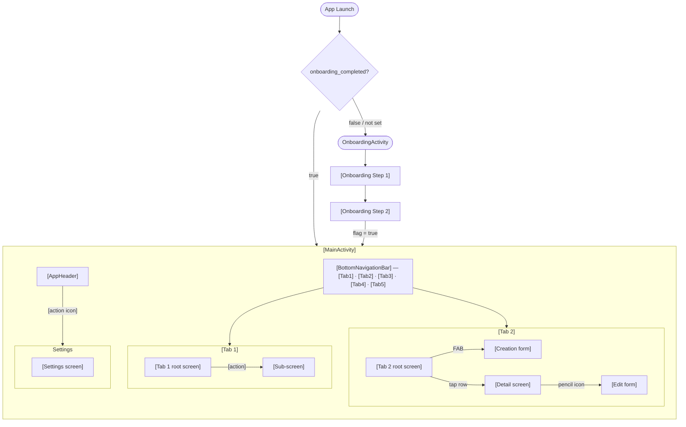

# Navigation Spec — [App Name]

**Version:** 0.0.1
**Status:** Draft
**Owner:** [Owner Name]
**Created at:** YYYY-MM-DD
**Last Updated:** YYYY-MM-DD

---

## Overview

This document defines the navigation structure, screen inventory, and flow for [App Name] across platforms. It serves as the reference for feature spec authors — every screen referenced in a feature spec should trace back to this document.

Phase 1 covers [Platform, e.g. Android]. Phase 3 covers [Platform, e.g. Web]. Additional platforms are deferred to Phase 4.

This document is intentionally lightweight — it captures structure and flow, not visual design or component-level UI detail. Those are defined per feature spec.

---

## Related Documents

| Document | Purpose |
|---|---|
| SPEC.md | Feature index and global business rules |
| ARCHITECTURE.md | Platform stack and navigation implementation |
| design.md | Design system, component patterns, visual identity |
| specs/features/home/requirements.md | Home shell — main activity, header, bottom nav, back navigation |
| specs/features/onboarding/requirements.md | Onboarding feature detail |
| specs/features/[feature]/requirements.md | [Feature] detail |

---

## Global Navigation Patterns

These patterns apply across all screens unless a feature spec explicitly overrides them.

### Detail Screen vs. Direct Edit

Entity types follow one of two interaction patterns on row tap:

| Entity | Tap behavior | Edit access |
|---|---|---|
| [Entity with rich detail, e.g. Account] | Opens [Entity] Detail screen | Pencil icon on detail screen |
| [Simple entity, e.g. Category] | Opens [Entity] Edit form directly | — |

**Rationale:** Entities with contextual detail (charts, history, computed totals) warrant a dedicated detail screen. Simpler entities open the edit form directly — faster and more appropriate for frequent edits.

### FAB Patterns

Two FAB variants are used:

**Standard FAB** — single primary action. Used on screens where there is exactly one creation action.

**Speed Dial FAB** — expands on tap to reveal 2–5 labeled sub-actions. Used on screens where there are multiple distinct creation actions. Speed Dial is only used when the distinction between actions is meaningful to the user.

### Destructive Action Confirmation

All destructive actions (delete, clear data, etc.) require a confirmation dialog before executing. No silent deletes anywhere in the app.

### [Reusable Navigator Component, e.g. Month Navigator]

[Describe any reusable navigation control that appears across multiple screens, its behavior, and its constraints. Example: a period/month navigator with forward/back arrows and a disabled future state.]

### Empty States

Every list screen defines two layers of empty state where applicable:

1. **Dependency not met** — a required prerequisite entity does not exist yet. The empty state guides the user to create the prerequisite first.
2. **No data yet** — prerequisites exist but no records have been created. The empty state encourages the user to create their first record.

Empty state anatomy: illustration placeholder + headline + subtext + primary CTA button.

### Sub-Screen Navigation

Sub-screens (detail screens, creation forms, and edit forms) are displayed full-screen. This is a global pattern that applies across all features.

**What changes on a sub-screen:**
- The shell [AppHeader] is not visible
- The [BottomNavigationBar / sidebar] is not visible
- A feature-owned top bar replaces the shell header, containing:
  - **Back arrow** (left) — tapping it pops the current screen from the stack
  - **Screen title** — typically the entity name or a generic label (e.g. "Add Account"). Defined per feature spec.
  - **Optional actions** (right) — feature-specific (e.g. edit icon, pin icon). Defined per feature spec.

**What stays the same:**
- System back button and back gesture behavior
- Theme and design system tokens

**Applies to:** [list all feature areas that introduce sub-screens]

### Pinning

[If your app uses pinning:] [Entity A], [Entity B], and [Entity C] detail screens each have a pin icon. The icon toggles between pinned (filled) and unpinned (outline) state. Pinned items always appear at the top of their respective list screens, sorted by `pinned_at` ascending (earliest pinned appears first).

The pin button is not present on list screens, edit forms, or creation forms.

---

## [Platform 1] Navigation

> Example: Android Navigation

### App Launch Logic

On every launch, the app reads a launch flag from local storage before deciding where to start:

```
App Launch
    │
    └──► Read [onboarding_completed] from [SharedPreferences / DataStore]
              │
              ├── false (or not set) ──► [OnboardingActivity / OnboardingFlow]
              │                               └──► [Completion step]: set flag = true
              │                                         └──► [MainActivity]
              │
              └── true ──► [MainActivity] directly
```

> Phase 2 addition: insert a session token check between the flag read and `MainActivity` to redirect unauthenticated users to the login screen.

### App Structure

```
[MainActivity]
├── [AppHeader]
│   ├── [Context-sensitive title or wordmark]
│   └── [Optional action, e.g. gear icon → Settings]
└── [BottomNavigationBar] (icon-only)
    ├── [Tab 1: e.g. Dashboard]
    ├── [Tab 2: e.g. Accounts]
    ├── [Tab 3: e.g. Transactions]
    ├── [Tab 4: e.g. Budgets]
    └── [Tab 5: e.g. Goals]
```

- The [AppHeader] [auto-hides on scroll / is always visible]. Context-sensitive behavior: [e.g. shows app name on primary tab, shows tab name on other tabs].
- The bottom nav bar is [icon-only / icon + label].
- [AppHeader] and [BottomNavigationBar] are hidden on sub-screens. See Sub-Screen Navigation above.

---

## Screen Inventory

### [Onboarding]

| Screen | Route | Description |
|---|---|---|
| [Welcome] | `onboarding/welcome` | [Description] |
| [Step 1] | `onboarding/[step]` | [Description] |
| [Step 2] | `onboarding/[step]` | [Description] |

**Exit condition:** [What flag is set and when. E.g. "Flag is set to true when the user taps Continue on [specific step]."]

---

### [Tab 1: e.g. Dashboard]

**Root screen:** [Dashboard screen]

| Screen | Route | Entry point | Description |
|---|---|---|---|
| [Dashboard] | `[tab]/root` | Bottom nav | [Description] |
| [Sub-screen] | `[tab]/[sub]` | [Entry action] | [Description] |

---

### [Tab 2: e.g. Accounts]

**Root screen:** [Accounts list]

| Screen | Route | Entry point | Description |
|---|---|---|---|
| [Entity list] | `[tab]/root` | Bottom nav | [Description] |
| [Entity detail] | `[tab]/[id]` | Tap row | [Description] |
| [Creation form] | `[tab]/create` | FAB | [Description] |
| [Edit form] | `[tab]/[id]/edit` | Pencil icon | [Description] |

---

### [Tab 3: e.g. Transactions]

> Repeat the pattern above for each tab.

---

### [Settings]

**Entry point:** [Gear icon on AppHeader / Settings tab]

| Screen | Route | Entry point | Description |
|---|---|---|---|
| [Settings root] | `settings/root` | [Entry] | [Description] |
| [Sub-screen] | `settings/[sub]` | [Entry action] | [Description] |

---

## [Platform 2] Navigation

> Example: Web Navigation (Phase 3)

### Layout

The web platform uses a [sidebar / top navigation] instead of a bottom navigation bar. Navigation structure mirrors the mobile tabs:

| Sidebar item | Maps to mobile tab |
|---|---|
| [Item 1] | [Tab 1] |
| [Item 2] | [Tab 2] |
| [Item 3] | [Tab 3] |

### Web Onboarding

[Brief description of first-time web user flow. Full spec defined at Phase 3 kickoff.]

---

## Navigation Diagram

> Use Mermaid flowchart syntax. The diagram should reflect the full app flow — launch logic, onboarding, all tabs, settings, and sub-screens. Update this diagram whenever the screen inventory changes.



> Expand the diagram to cover all tabs, sub-screens, and the web sidebar as you build out the screen inventory. Color coding is optional but useful for distinguishing launch flow, main app, and web.

---

## Open Questions

- [[Navigation decision pending implementation, e.g. "Month picker — tap label to open fast navigation or not?"]
- [[Scope of entity history — all-time or rolling window on detail screens?]
- [[Web onboarding — full spec deferred to Phase 3 kickoff]]
- [[Quick-add inline creation during entity creation forms — deferred to feature spec]]

---

## Changelog

| Version | Date | Author | Notes |
|---|---|---|---|
| 0.0.1 | YYYY-MM-DD | [Author] | Initial draft |
